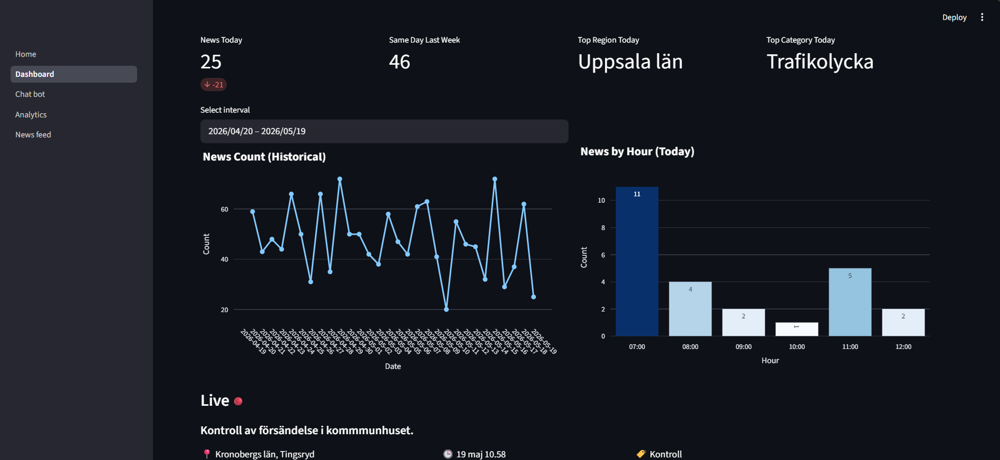
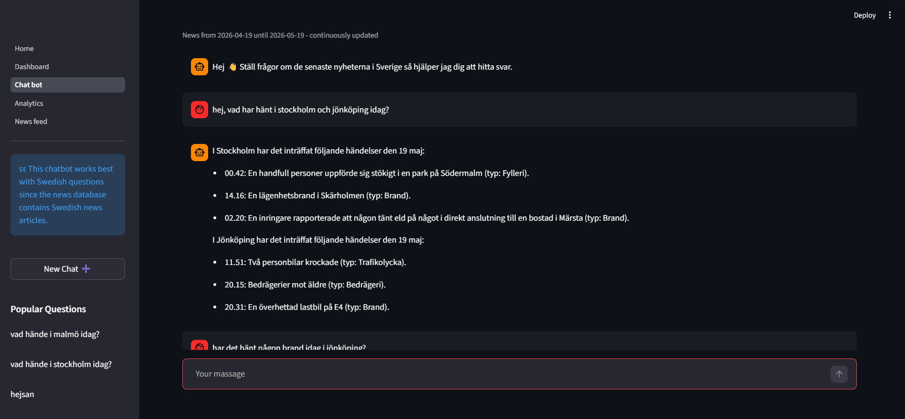
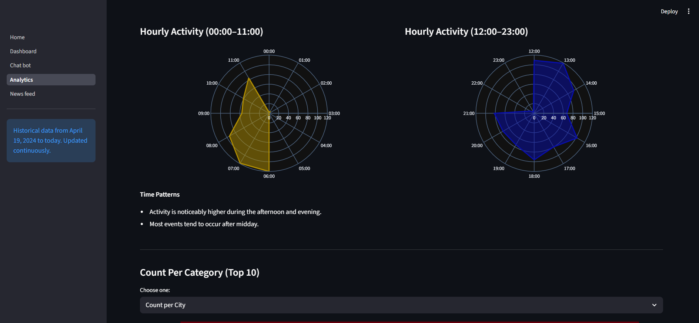
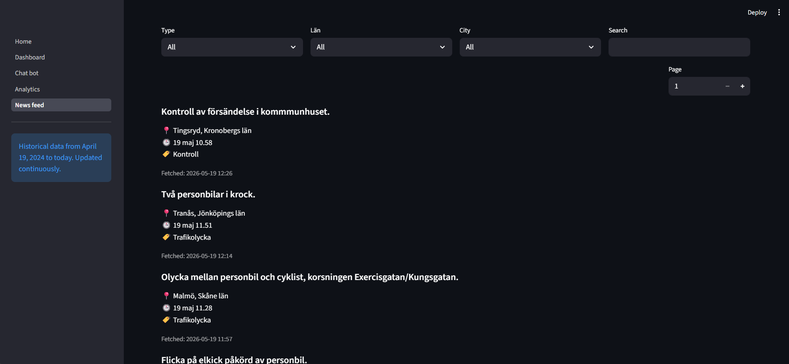

# Swedish News Intelligence Platform

An AI-powered news intelligence system that transforms Swedish news data into an interactive experience using semantic search, large language models, and data visualization.

---

## Overview

Users can:
- Chat with an AI assistant using real news data (RAG system)
- Search and filter structured news articles
- Analyze trends using visualizations
- Browse a full news feed of historical and recent articles

The system enables natural language queries that return context-aware answers based on real events in Sweden.


---

## Architecture Overview (Chatbot Pipeline)

User Query  
→ Streamlit UI  
→ LLM (Query Parser)  
→ Embedding Search  
→ Supabase Vector Database  
→ Filtered News Results  
→ GPT Response Generation  
→ User Output  

---

## Application pages

The platform consists of multiple pages including Chatbot, Dashboard, Analytics and News feed.

---

## Tech Stack

- Python
- Streamlit
- OpenAI API (GPT + Embeddings)
- Supabase (PostgreSQL + Vector Search)
- GitHub Actions
- Pandas
- Plotly

---

## Data Pipeline

The system uses an automated pipeline to collect and process Swedish police event data.

1. Data is retrieved from APIverket (`/police/events`)
2. Data is cleaned and stored in Supabase
3. New entries are embedded using OpenAI
4. GitHub Actions runs the pipeline hourly

---


## Environment Variables

Create a `.env` file in the project root and add the following variables:

```env
OPENAI_KEY=your_openai_api_key
SU_URL=your_supabase_url
SU_KEY=your_supabase_key
API_KEY=your_Apiverket_key
```

---

## Database Design

The project uses multiple PostgreSQL functions and views built on top of the `cleaned_news` table to simplify analytics queries, filtering, and dashboard aggregation.The database schema, tables, and functions are managed in Supabase.

---

## Setup

Note: Database schema and SQL functions are managed in Supabase and are required for full functionality.
SQL scripts for schema, views, and functions will be added in a future update.

Install the required dependencies:

```bash
pip install -r requirements.txt
```
Run the application:
```bash
streamlit run Home.py
```
---

## LLM Query Logging

Messages flagged by the moderation system automatically trigger a database entry with `flagged = True` and a timestamp for monitoring and safety analysis.

## App screenshots

<p align="center">
  
  
</p>

<p align="center">
  
  
</p>